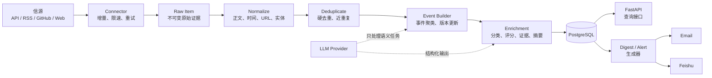

# AI × Security 情报后端 MVP 设计方案

> 版本：v0.3
> 状态：实施基线（M0 + M1 + M2.1 可扩展事件情报底座 已完成）<br>
> 最后更新：2026-07-31
> 相关文档：[完整目标蓝图](./system-design.md) · [信源注册表](./source-registry.md) · [M1 增量与分类](./m1-data-pipeline.md) · [M2 事件情报](./event-intelligence.md)

## 1. 已确认的产品与技术决策

| 决策 | MVP 选择 |
|---|---|
| 产品核心 | 后端情报服务，而不是新闻网站或纯 Skill |
| 第一批用户 | 单个用户或小范围可信内部用户 |
| 主要出口 | 每日日报、紧急告警、只读查询 API |
| 首发渠道 | 邮件、飞书 |
| 网站 | 暂不建设；API 文档和数据库管理工具不算产品网站 |
| Agent / Skill | 暂不作为核心；后续通过 API/MCP 接入 |
| 架构 | 模块化单体，API 与 Worker 分进程运行 |
| 开发语言 | Python 3.13 |
| 数据库 | PostgreSQL 18；托管环境不支持时使用 PostgreSQL 17 |
| 开发环境 | Windows 11 主机 + WSL2 Ubuntu 24.04 LTS |
| 部署环境 | Linux VM + Docker Compose |

当本文与完整目标蓝图发生冲突时，MVP 实现以本文为准。

## 2. MVP 目标

在无人值守的情况下持续完成：

1. 从第一批信源增量获取内容。
2. 保存可回放的原始证据和采集状态。
3. 标准化、硬去重并形成事件候选。
4. 将事件分类到四条主线。
5. 生成带来源、可信度和行动建议的中文日报。
6. 将日报投递到邮件和飞书。
7. 对少量满足硬规则的事件发送紧急告警。
8. 通过 API 查询事件、日报和信源健康状态。

### 2.1 四条内容主线

- `ai`
- `ai_for_security`
- `ai_enabled_threats`
- `security_for_ai`

### 2.2 MVP 不做

- 不做公开网站、用户注册、付费订阅和 SEO。
- 不做面向任意用户的多租户权限系统。
- 不接入全部候选信源。
- 不依赖个人微信机器人。
- 不开放 Agent 自由浏览、自由执行或自由发布。
- 不自动执行 PoC、Notebook、模型文件和附件。
- 不建设知识图谱数据库、Kafka、Kubernetes 或微服务。
- 不把向量检索、LangChain 或多 Agent 作为基础依赖。
- 不要求一次解决所有中文全文搜索问题。

## 3. MVP 验收标准

连续运行 7 天并满足：

| 指标 | 目标 |
|---|---:|
| P0 结构化来源采集成功率 | 不低于 98% |
| 网页型来源解析成功率 | 不低于 90% |
| 日报 Top 10 人工相关率 | 不低于 80% |
| 日报重复事件率 | 低于 5% |
| 已发布事件原始链接覆盖率 | 100% |
| 高风险事件一手/权威来源覆盖率 | 100% |
| 日报按时生成率 | 不低于 99% |
| 邮件、飞书投递成功率 | 不低于 99% |
| 进程重启后的重复推送 | 0 |
| 采集内容导致命令或代码执行 | 0 |

网页解析成功指标题、发布时间、正文或结构化事实达到该来源的最低发布要求；仅成功返回 HTTP 200 不算解析成功。

## 4. 逻辑架构



### 4.1 运行进程

同一代码库和同一 Docker 镜像，以不同启动命令运行：

| 进程 | 职责 | 是否对外开放 |
|---|---|---:|
| `api` | 事件、日报、告警和健康查询 | 是，默认仅内网 |
| `worker` | 调度、采集、解析、聚类、摘要和投递 | 否 |
| `postgres` | 数据、状态、幂等和审计 | 否 |
| `playwright` | 仅预留 Compose Profile；Connector 与浏览器镜像尚未实现 | 否 |

MVP 只有一个 `worker` 实例。即使如此，任务也必须使用数据库幂等键和租约，保证重启或误启动第二实例时不会重复处理。

### 4.2 模块边界

```text
domain          事件、证据、信源、日报等领域模型
connectors      协议级采集器
parsers         信源解析 Profile 与少量专属 Hook
pipelines       标准化、去重、聚类、分类、评分、摘要
repositories    PostgreSQL 数据访问
jobs            调度任务和运行租约
delivery        邮件、飞书及投递幂等
llm             模型供应商适配器和结构化输出
api             FastAPI 路由与 Schema
```

模块之间通过 Python 接口和领域对象调用，不拆成网络微服务。

## 5. 信源与 Connector 设计

### 5.1 接入优先级

固定使用：

```text
官方 API
→ RSS/Atom
→ GitHub API
→ 静态网页适配器
→ 动态浏览器
→ 搜索/社区发现
```

搜索和社区只能发现线索，不能单独形成高置信事件。

### 5.2 Connector 接口

```python
class Connector:
    async def poll(self, endpoint, checkpoint) -> list[RawItem]:
        ...

    async def health(self, endpoint) -> SourceHealth:
        ...
```

解析与传输分离：

```text
Connector：负责请求、分页、限速、游标和响应
Parser：负责把响应映射成 NormalizedDocument
```

当前实现八类 Connector：

1. `RSSConnector`
2. `RestApiConnector`
3. `NvdConnector`（modified-time 动态缩窗 + durable catch-up cursor）
4. `AIHotConnector`（selected snapshot + changes + remove + 409 rebuild）
5. `GitHubConnector`
6. `WebListConnector`
7. `ArxivConnector`
8. `SitemapConnector`（列表页快速发现 + Sitemap 重叠对账 → 并发抓取原文 → trafilatura 抽正文）

`playwright` 仅保留枚举和 Compose Profile 运行位；当前没有 `PlaywrightConnector` 或浏览器镜像，不能作为实际抓取能力启用。

Connector 支持两种 poll 模式：

- **同步 `poll()`**：RSS / REST / AI HOT / GitHub / Web / arXiv，在 `run_in_executor` 中调度。
- **异步 `apoll()`**：Sitemap，列表页快速路径只抓未知 URL；对账路径使用 `asyncio.gather + Semaphore` 并发抓取候选文章。异步请求复用连接池，但请求启动仍严格服从 endpoint RPM。

### 5.3 Source Policy

每个 endpoint 通过 YAML 配置差异，不在调度代码中写站点判断：

```yaml
id: openai-news-rss
source_id: openai
enabled: true
connector: rss
parser: rss-default-v1
url: https://openai.com/news/rss.xml
trust_tier: A
priority: P0
language: en

schedule:
  interval_minutes: 30
  jitter_seconds: 120

fetch:
  timeout_seconds: 20
  max_response_bytes: 5242880
  max_redirects: 3
  requests_per_minute: 2

topics:
  - ai
  - security_for_ai
```

MVP Source Policy 至少包含：

- Connector 与 Parser 版本
- URL 和是否启用
- 优先级、可信度、语言
- 调度间隔和随机抖动
- 超时、限速、重定向和响应大小
- 主题范围
- robots/条款审核状态
- checkpoint 类型
- 连续失败阈值

### 5.4 当前配置 19 个 endpoint（18 active + 1 retired；17 个 source）

> 4 个 GitHub Releases endpoint（langchain/dify/ollama/vllm）因内容噪音过大已删除；AI HOT 已从 50 条 RSS 升级为 selected snapshot/changes 专用连接器。注册表保留旧 RSS 作为 retired 审计记录，因此共有 19 个配置项、18 个 active endpoint。

| # | Endpoint | Connector | Parser | 增量机制 |
|---|---|---|---|---|
| 1 | openai-news-rss | RSS | rss-default-v1 | ETag/304 + native ID/content hash |
| 2 | cisa-kev | REST | cisa-kev-v1 | 官方镜像 + ETag/304 + 修订/删除检测 |
| 3 | nvd-recent | NVD | nvd-v2 | 120d durable 分片 bootstrap/catch-up + 15min 稳态 overlap |
| 4 | anthropic-news | **Newsroom + Sitemap** | sitemap-article-v1 | 快速发现 + 每日 72h 重叠对账 |
| 5 | huggingface-blog-rss | RSS + fulltext | rss-default-v1 | ETag/304 + content hash |
| 6 | google-security-rss | RSS | rss-default-v1 | native ID/content hash（无稳定 HTTP validator） |
| 7 | trailofbits-rss | RSS | rss-default-v1 | ETag/304 + content hash |
| 8 | portswigger-research-rss | RSS + fulltext | rss-default-v1 | ETag/304 + content hash |
| 9 | arxiv-ai-llm | arXiv | arxiv-v1 | native ID/content hash；304 辅助 |
| 10 | arxiv-security-ai | arXiv | arxiv-v1 | native ID/content hash；304 辅助 |
| 11 | hackernews-rss | RSS | rss-default-v1 | HNRSS Last-Modified/304 + content hash |
| 12 | ithome-rss | RSS | rss-default-v1 | ETag/304 + content hash |
| 13 | google-blog-ai-rss | RSS | rss-default-v1 | ETag/304 + content hash |
| 14 | github-trending-rss | RSS | rss-default-v1 | ETag/304 + content hash |
| 15 | aihot-selected-api | AI HOT | aihot-v1 | snapshot + changes + remove + 409 rebuild |
| 16 | apple-ml-research-rss | RSS | rss-default-v1 | ETag/Last-Modified/304 + content hash |
| 17 | nvidia-blog-rss | RSS | rss-default-v1 | ETag/Last-Modified/304 + content hash |
| 18 | wiz-blog-rss | RSS | rss-default-v1 | ETag/Last-Modified/304 + content hash |
| 19 | aihot-selected-rss | RSS（retired） | rss-default-v1 | 已由 aihot-selected-api 替代；不再调度 |

Apple、NVIDIA、Wiz 直接复用官方 RSS。AI HOT 已实现专用 `aihot-selected-v1` Connector：首次完整 snapshot，之后消费 opaque changes cursor，并支持 remove 与 409 自动重建；它不能用通用 REST/RSS 代替。旧 RSS 使用 `replaced_by` 审计式退役，既有文档保留为 history，API 是唯一 active 通道。

第一批的目标是验证八类 Connector、中文/英文处理和四条内容主线，不代表最终内容覆盖完整。

## 6. 采集与处理流程

### 6.1 增量采集

每个 endpoint 保存：

- `etag`
- `last_modified`
- `cursor`
- `last_published_at`
- `last_fetched_at`
- `last_success_at`（上次成功抓取时间，用于 NVD 重叠时间窗）
- `content_hash`
- `consecutive_failures`
- `next_run_at`
- `lease_until`、`lease_token`（心跳续租 + fencing）
- `status`、`replacement_endpoint_id`、`retired_at`（采集通道生命周期与替代链）

增量过滤优先级：

1. **API/水位增量**：NVD 用 durable 分片 cursor 完成 bootstrap/catch-up，稳态从 `last_success_at - overlap` 开始；Sitemap 使用独立内容水位和 72 小时重叠窗口。
2. **known content 过滤**：Checkpoint 携带最近的 `native_id → content_hash`；未变化内容在 Connector 层过滤，已有 ID 的内容变化会生成新 RawItem 版本。
3. **HTTP 级增量**：ETag/304，部分源有效（CISA），部分源几乎不返回 304（arXiv）。
4. **DB 级幂等兜底**：`ON CONFLICT DO NOTHING` 保护内容版本唯一键；完全相同的 `(endpoint_id, native_id, content_hash)` 不重复写入。

处理顺序：

```text
领取 endpoint 租约与 fencing token
→ 长任务周期心跳续租
→ 带 checkpoint 请求
→ 校验 token 后写入 Raw Item
→ 提交事务
→ 再次校验 token 后推进 checkpoint 并释放租约
```

必须先保存 Raw Item，再推进 checkpoint，避免进程崩溃造成数据永久遗漏。

当前实现边界：

- known-content 映射默认读取每个 endpoint 最近 5,000 个 SourceRecord；AI HOT 配置为 10,000。DB 唯一约束继续对全历史兜底。
- RSS/arXiv 的覆盖范围受上游 feed/API 返回窗口限制，超过保留期的停机无法仅靠 content hash 补回。
- NVD 使用 120 天 durable 分片 bootstrap；120 天以前的首次全历史需要独立 backfill。
- Anthropic 每 2 小时检查 Newsroom，每 24 小时执行一次最多 50 URL、72 小时重叠的 Sitemap 对账。
- AI HOT 和 CISA 支持撤回；NVD `vulnStatus` 映射为 published/rejected/withdrawn/unknown；普通窗口型 feed 无法可靠推断删除。
- 当前视图统一要求 `source_status=active` 且 `record_status` 不是 rejected/withdrawn；API、导出、report、分类与 M2 均复用该条件。详见 [M1 实现说明](./m1-data-pipeline.md)。

### 6.2 原始证据

`RawItem` 至少保存：

- 来源和 endpoint
- 来源原生 ID
- 请求 URL、最终 URL
- HTTP 状态和必要响应头
- 发布时间和采集时间
- 原始语言
- 原始文本或受控快照
- SHA-256 内容哈希
- Connector 和 Parser 版本

原始内容不可变；修正通过新版本完成。

### 6.3 标准化

输出统一 `NormalizedDocument`：

- 原文标题
- 中文标题
- 正文文本
- canonical URL
- 作者和机构
- 原始发布时间及 UTC 时间
- 语言
- CVE、GHSA、CNVD、CNNVD、CWE
- 公司、模型、产品、仓库、包和版本
- 原始元数据

### 6.4 去重与事件聚类

MVP 分三步：

1. 硬去重：来源原生 ID、canonical URL、内容哈希。
2. 近重复：标准化标题、RapidFuzz、SimHash。
3. 事件候选：时间窗、共享实体、事件类型、语义相似度。

强合并键：

- 相同 CVE/GHSA/CNVD/CNNVD。
- 相同模型、版本和发布类型。
- 相同公司、事故类型和相近时间。

规则先生成候选；LLM 只处理边界模糊的候选。高风险事件合并置信度不足时，保留为独立事件并标记 `review_needed`。

### 6.5 事件更新

同一事件的新文章不生成新卡片，而是：

- 增加证据来源。
- 更新置信度。
- 更新生命周期。
- 生成新的事件版本。

只有以下变化允许重新推送：

- `reported → confirmed`
- `poc_public → exploited_in_wild`
- `unpatched → patched`
- 风险等级显著提高
- 原结论被更正或撤回

## 7. 事实、评分与 LLM 边界

### 7.1 证据等级

| 等级 | 定义 |
|---|---|
| A | 官方公告、权威漏洞库、论文原文、项目 Release |
| B | 可信研究团队或多个独立专业来源 |
| C | 单一媒体、个人研究者、社区线索 |
| D | 无法定位原文的传闻、截图或二次转载 |

高风险告警至少需要一个 A 级来源，或一个 B 级研究来源加独立验证。

### 7.2 评分

```text
relevance       0-30
impact          0-20
evidence        0-20
novelty         0-10
corroboration   0-10
actionability   0-10
```

同时单独保存：

- `confidence`
- `urgency`
- `personal_relevance`

### 7.3 LLM 可以做

- 四条主线和事件类型分类
- 实体别名建议
- 模糊事件聚类建议
- 影响分析
- 中文摘要
- 不确定性表述
- MITRE ATLAS、OWASP 等映射建议

### 7.4 LLM 不可以做

- 覆盖 CVE/GHSA/KEV/EPSS/CVSS 等权威字段
- 修改原始 URL 和发布时间
- 决定是否执行代码或附件
- 在无证据时把 `reported` 改成 `confirmed`
- 直接修改已发布事件而不产生版本

所有 LLM 输出：

- 使用 Pydantic Schema 校验。
- 保存模型、Prompt 版本和输入哈希。
- 按输入哈希缓存。
- 校验失败时重试一次，仍失败则进入降级流程。

模型不可用时，采集、标准化和硬去重继续运行；日报可以延迟或生成事实字段版，不能丢弃原始数据。

## 8. 最小数据模型

| 表 | 关键内容 |
|---|---|
| `sources` | 名称、可信度、语言、机构 |
| `source_endpoints` | Connector、Parser、URL、Policy、checkpoint、健康状态、替代 endpoint 与退役时间 |
| `fetch_runs` | 开始结束时间、状态、数量、错误、租约 |
| `raw_items` | 原始证据、哈希、请求元数据、版本 |
| `documents` | 标准化正文、标题、时间、标识符、本地 source_status、上游 record_status、分类，以及 M2 去重主记录/原因/分数/算法版本 |
| `document_signatures / document_identities / document_block_tokens / document_block_token_stats` | URL/title/content hash、强身份、SimHash/MinHash 候选索引及可增量维护的桶计数 |
| `duplicate_components / m2_work_items / m2_runs` | 稳定组件、局部失效待办、算法版本与 replay 审计 |
| `events` | 稳定 fingerprint、类型、主线、确定性摘要、证据等级、评分、观测时间、聚类版本和当前版本 |
| `event_documents` | 事件与文档关系、支持/反对、来源等级、关联原因 |
| `event_versions / claims / claim_evidence` | 不可变事件快照、确认/争议事实、支持/反驳证据 |
| `candidate_reviews` | 低置信候选、强冲突留痕、人工裁决和算法版本 |
| `digests` | 日期、状态、生成版本和目标 Profile |
| `digest_items` | 排序、栏目、事件、摘要版本 |
| `delivery_runs` | 渠道、目标、幂等键、状态、错误和时间 |
| `feedback` | 事件、反馈类型和备注 |

MVP 不建立独立图数据库。实体和框架映射先存规范字段与 JSONB；确认查询模式后再规范化为更多关系表。

关键唯一约束：

```text
raw_items(endpoint_id, native_id, content_hash)
raw_items(endpoint_id, canonical_url, published_at, content_hash)
delivery_runs(channel, target, payload_hash)
events(fingerprint)
event_documents(event_id, document_id)
```

## 9. API

### 9.1 公开给可信客户端的只读接口

```http
GET /health
GET /v1/events
GET /v1/events/{event_id}
GET /v1/digests/daily
GET /v1/digests/{date}
GET /v1/alerts
GET /v1/sources/health
```

M2.1 当前代码提供同语义的 `GET /events`、`GET /events/{event_id}` 和 `/stats`；按指定日期返回完整热点的接口和统一 `/v1` 前缀在 M2.2 API 契约中补齐。

查询条件至少支持：

- 时间范围
- 四条主线
- 事件类型
- 最低分数
- 可信度
- 实体/CVE/仓库关键词

### 9.2 写接口

```http
POST /v1/feedback
```

管理操作首期使用 CLI，不开放公网管理 API：

```text
intel source list
intel source enable <id>
intel source disable <id>
intel source poll <id>
intel digest generate <date>
intel digest deliver <date> --channel feishu
intel event reprocess <id>
```

## 10. 调度与任务

| 任务 | 默认频率 |
|---|---:|
| KEV、GHSA 等高优先级结构化源 | 15～30 分钟 |
| 官方 RSS | 30 分钟 |
| 常规 API | 30～60 分钟 |
| 官方网页适配器 | 2 小时 |
| arXiv | 6 小时 |
| 重新处理失败任务 | 指数退避 |
| 日报冻结窗口 | 北京时间 07:30 |
| 日报投递 | 北京时间 08:30 |
| 数据保留与健康汇总 | 每日一次 |

APScheduler 分别触发 fetch、normalize、fulltext、classify、event 与 self-check；每个 endpoint 的真实到期时间、租约和运行结果保存在 PostgreSQL，不能只依赖 Scheduler 内存状态。各阶段 job 独立限并发：长 NVD fetch 不会阻塞每 10 秒、每批 2,000 条的 normalize。

## 11. 日报和告警

### 11.1 日报结构

```text
今日最重要的 3～5 条
AI
AI for Security
AI-enabled Threats
Security for AI
值得关注但尚未确认
信源与系统状态摘要
```

单条事件：

```text
标题
发生了什么
为什么重要
影响对象
证据与不确定性
建议行动
原始来源
```

### 11.2 紧急告警候选

- `KEV=true` 且命中固定资产/框架清单。
- 官方确认重要 AI 服务安全事故。
- 公开可利用的 AI/Agent RCE、鉴权绕过或凭证泄露。
- 生命周期升级为 `exploited_in_wild`。
- 已推送事件出现重要更正或撤回。

MVP 使用配置文件维护单个默认 Profile 和固定关注清单，不建设完整用户偏好系统。

### 11.3 投递适配器

统一接口：

```python
class DeliveryAdapter:
    async def send(self, target, payload, idempotency_key) -> DeliveryResult:
        ...
```

第一版：

- `EmailDelivery`
- `FeishuWebhookDelivery`

需要私聊、交互卡片和用户身份后，再增加 `FeishuAppDelivery`。

## 12. 技术栈

| 类别 | MVP 选择 |
|---|---|
| Python | Python 3.13 |
| 项目与依赖 | uv、`pyproject.toml`、`uv.lock` |
| API | FastAPI、Pydantic 2、Uvicorn |
| 数据库 | PostgreSQL 18 |
| 数据访问 | SQLAlchemy 2、Alembic、Psycopg 3 |
| 调度 | APScheduler，使用持久化 Data Store |
| 网络 | HTTPX AsyncClient |
| RSS | feedparser |
| HTML | lxml、Trafilatura |
| 动态网页 | Playwright（M2+ 候选，当前未包含） |
| 重试 | Tenacity |
| 相似度 | RapidFuzz、SimHash；向量暂不作为必需项 |
| 模板 | Jinja2 |
| 日志 | 标准库 Logging 输出 JSON；需要时再引入 structlog |
| 测试 | pytest、pytest-asyncio、respx |
| 质量 | Ruff、Pyright |
| 部署 | Docker Compose |

技术依据：

- [FastAPI](https://fastapi.tiangolo.com/) 与 Pydantic 适合类型化 API 和自动 OpenAPI。
- [SQLAlchemy 2](https://docs.sqlalchemy.org/en/20/) 支持同步和异步数据访问。
- [PostgreSQL 版本策略](https://www.postgresql.org/support/versioning/)为长期维护提供明确周期。
- [APScheduler](https://apscheduler.readthedocs.io/en/master/userguide.html)支持持久化任务存储。
- [Trafilatura](https://trafilatura.readthedocs.io/en/stable/)用于网页正文和元数据抽取。
- [Playwright Python](https://playwright.dev/python/docs/intro)是未来动态页面兜底候选，当前构建未包含。

### 12.1 明确不引入

MVP 不引入：

- Redis
- Celery/Dramatiq
- Kafka
- Elasticsearch/OpenSearch
- 独立向量数据库
- LangChain/LangGraph
- Kubernetes
- React/Next.js

## 13. 代码结构

```text
src/
└── ai_security_hot/
    ├── api/
    ├── cli/
    ├── config/
    ├── connectors/        FetchContext (sync get + async aget) + 6 类连接器
    ├── parsers/           各源 Parser + normalize
    ├── classify/          RuleClassifier + taxonomy.yaml + Classification 溯源
    ├── events/            M2 去重、强键事件聚类、证据等级和规则评分
    ├── pipelines/         fetch/normalize/fulltext/classify/dedupe/cluster stages
    ├── domain/            枚举 + RawItem/NormalizedDocument/Checkpoint（known content + 内容水位）
    ├── storage/           BlobStore + repositories（租约/幂等/阶段推进/导出）
    ├── models/            SQLAlchemy 表 + 会话
    ├── jobs/              无状态调度 tick + self_check
    ├── delivery/
    ├── llm/
    └── main.py

sources/
├── sources.yaml          19 个 endpoint 配置（18 active + 1 retired）
├── taxonomy.yaml         分类规则词表
└── parsers/

tests/
├── fixtures/
├── test_unit.py          SSRF/规范化/连接器/分类器逻辑
├── test_smoke.py         集成冒烟
└── integration/          真实爬取（INTEL_RUN_LIVE=1）

migrations/               Alembic（initial + classification + 内容版本 + M2 + M1 lifecycle/LLM audit）
compose.yaml
Dockerfile
pyproject.toml
uv.lock
```

当前小型 RSS/JSON/XML/HTML 固定响应直接放在 `tests/test_smoke.py`；`tests/fixtures/` 预留给较大的脱敏历史样本。默认测试不得依赖真实网站，真实源检查只通过 `INTEL_RUN_LIVE=1` 显式启用。

## 14. Windows 开发与 Linux 部署

### 14.1 推荐方式

```text
Windows 11
→ WSL2 Ubuntu 24.04 LTS
→ 代码存放于 WSL Linux 文件系统
→ uv/Python/Git 在 WSL 内运行
→ Docker Desktop 使用 WSL2 Backend
```

不要在同一项目混用 Windows Python 和 WSL Python。

### 14.2 开发循环

快速开发：

```text
PostgreSQL：Docker
API：WSL 中 uv run
Worker：WSL 中 uv run
测试：WSL 中 uv run pytest
```

发布前：

```text
docker compose build
docker compose up
执行数据库迁移
执行单元和集成测试
执行一轮固定 Fixture 采集回放
```

### 14.3 跨平台约束

- 使用 `pathlib`，禁止硬编码 Windows/Linux 绝对路径。
- 代码、YAML、Dockerfile 和 Shell 使用 LF。
- 模块和文件名大小写必须一致。
- 数据库存 UTC，调度显式使用 `Asia/Shanghai`。
- PostgreSQL 使用 Docker Named Volume。
- CI 至少在 Linux 上运行。

## 15. 安全边界

### 15.1 URL 获取

- 仅允许 HTTP(S)。
- 阻止 localhost、私网、link-local 和云元数据地址。
- DNS 解析前后都检查目标 IP。
- 限制重定向次数、响应大小、超时和内容类型。
- 默认不执行 JavaScript。
- 按 endpoint 配置域名允许列表。

### 15.2 内容处理

- HTML、论文、Issue、PoC 和模型卡均为不可信输入。
- 不将网页内容拼接进系统级指令。
- 不运行网页中的命令、代码、宏和 Notebook。
- 不自动下载附件。
- PDF、压缩包和模型文件留到隔离处理扩展阶段。

### 15.3 凭据

- 数据库、LLM、邮件和飞书凭据来自 Secret/环境变量。
- 不进入日志、Prompt、原始证据或 API 响应。
- 查询 API 使用单独只读 Token；反馈接口使用权限受限的独立写 Token。
- 管理 CLI 只在服务器或可信内网使用。

## 16. 测试和可观测性

### 16.1 必须测试

- 每种 Connector 的分页、增量和限速。
- ETag/Last-Modified 和 checkpoint 恢复。
- 每个网页 Parser 的历史 Fixture。
- URL 规范化和硬去重。
- 事件强合并键。
- LLM Schema 校验失败和降级。
- 投递幂等、重试和更正通知。
- Worker 中断后重新启动。
- SSRF、重定向、超大响应和恶意 HTML。

当前测试共 68 项，其中 67 项非 live，覆盖 AI HOT snapshot/changes/remove/409、CISA 权威快照撤回、NVD 参数、HTTP 重试、M1.3 Schema/白名单/CVE bypass，以及 M2.1 的持久化签名、高频候选桶保护、强冲突、人工批准、reviewed 评测范围、局部退役重选主、EventVersion 和争议 Claim 证据；投递仍属于后续里程碑。

### 16.2 最小指标

- `fetch_success_total`
- `fetch_failure_total`
- `parse_success_total`
- `documents_created_total`
- `documents_deduplicated_total`
- `events_created_total`
- `events_updated_total`
- `llm_calls_total`
- `llm_validation_failure_total`
- `delivery_success_total`
- `delivery_failure_total`
- 每个 endpoint 的最后成功时间和连续失败次数

MVP 使用结构化日志、`/health`、`/stats` 和 self-check；self-check 已报告 `dedupe_due / cluster_due / events`。需要跨进程指标和告警后再增加 Prometheus/OpenTelemetry。

## 17. 实施里程碑

### M0：工程骨架 ✅

- 建立 Python 项目、Docker Compose 和 PostgreSQL。
- 建立领域对象、数据库迁移和配置加载。
- 实现 `api`、`worker`、健康检查和 CLI 骨架。
- 建立测试、Lint、类型检查和 Linux CI。
- FetchContext 统一出口层（SSRF 双检、限速、重试、超时）。
- 阶段化 DB 状态机（fetch → normalize → fulltext → classify）。
- 四类 Connector + Parser（RSS / REST / GitHub / Web）真实可跑。
- BlobStore + 二次抓取全文（fulltext stage）。
- 12 个真实源接入。

完成标准已达到：空系统可启动、迁移、调度、查询健康状态；在上游仍可重放的窗口内重启可续采，完全相同的内容不会重复落库。

### M1：结构化采集 ✅（部分合并到 M0）

- RSS、REST API、GitHub Connector。
- 接入前 9 个结构化 endpoint + 网页适配器。
- Raw Item、checkpoint、幂等和采集健康。
- **新增并升级 SitemapConnector**：Anthropic 从 Web 适配器迁移为 Newsroom 快速发现 + Sitemap 定期对账。
- **新增 ArxivConnector**：arXiv API 搜索。
- **新增并发 fetch pipeline**：`asyncio.gather` 最多 5 个 endpoint 同时抓取。
- **NVD modified-time 增量**：120 天 durable 分片 bootstrap/catch-up + 密度缩窗 + 15 分钟稳态 overlap。
- 18 个 active endpoint 真实可跑，另保留 1 个 retired endpoint 的审计配置。

### M1.1：规则分类 ✅

- RuleClassifier + taxonomy.yaml。
- 结构化 NVD/CISA 记录使用独立 `cve` 标签；新闻与论文使用 llm / agent / ai_for_security / security_for_ai / system_security 主题标签。完整四主线、特别是 ai_enabled_threats 的语义判定在 M2/M1.3 完成。
- 事件类型优先级（source_id → connector → CVE/GHSA → 关键词 → 默认）。
- Classification 溯源（method / rule_version / input_hash）。

### M1.2.x：增量优化 ✅

- RawItem 不可变内容/撤回版本 + SourceRecord 当前投影 + Document 双轴生命周期（source_status 与上游 record_status）。
- AI HOT snapshot/changes/remove/409 重建；CISA 权威快照删除检测。
- NVD 120 天 durable 分片 bootstrap/catch-up、密度缩窗和 15 分钟稳态 overlap。
- Anthropic Newsroom 快速发现 + 每日 Sitemap 重叠对账。
- endpoint state_version、YAML 删除自动暂停、`replaced_by` 审计式退役、正确的 4xx/429/5xx 重试语义。

### M1.3：混合分类 ✅

- provider registry、严格 JSON Schema/Pydantic/taxonomy 白名单。
- model_cache、model_runs、分类租约、缓存命中、指数退避与规则 fallback。
- 结构化 CVE 不调用 LLM；fetch/normalize/fulltext/classify/event 各 job 相互独立。

完整实现与非保证边界见 [M1 增量与分类](./m1-data-pipeline.md)。

### M2：事件情报 ✅（M2.1 可扩展底座）

- 非破坏式硬去重和 RapidFuzz 近重复，记录主文档、关系原因、相似分和算法版本。
- 持久化 URL/title/content hash、强身份、SimHash/MinHash blocking 和稳定重复组件。
- CVE/GHSA/CNVD/arXiv、GitHub release、模型/包发布、事故和 campaign 强键；无强键内容生成 fallback event。
- lifecycle/classification 变化写 durable work；去重只重算 seed、一跳候选及其完整旧组件，事件聚类只闭合受影响的强身份证据图；显式 replay 才遍历全库。
- 不同强身份硬冲突不可被语义或人工批准越过；低置信候选进入可裁决复核队列。
- EventVersion 保存完整事件/证据/Claim 快照和 diff；ClaimEvidence 支持 support/contradict/context。
- JSONL 评测器和 `M2Run` 审计已接通；PostgreSQL advisory lock 保证阶段单写。
- Worker、`intel eventize`、`/events` 列表/详情、`/stats` 和 self-check 已接通。

M2.1 基础完成标准已达到。下一步 M2.2 实现按日期返回去重、聚类后热点的 API；真实双人金标集、领域 Claim 抽取和可选 embedding 继续按评测数据推进。详见 [M2 事件情报实现说明](./event-intelligence.md)。

### M3：日报与推送

- 日报冻结、生成和版本化。
- 邮件、飞书模板。
- 投递幂等和失败重试。
- 少量硬规则紧急告警。

完成标准：连续 7 天达到第 3 节验收指标。

## 18. 后续扩展方向

### 18.1 信源扩展

- 增加安全实验室、政策、论文和国内来源。
- 增加 PDF/OCR 隔离处理。
- 为少量高价值动态网站启用 Playwright。
- 建立 Parser 漂移检测和 Shadow Run。

### 18.2 个性化与 Agent

- 多 Profile 和 Watchlist。
- 用户角色化摘要。
- 提供 MCP Server。
- 发布轻量 `ai-security-intel` Skill。
- 接入 Hermes/OpenClaw 进行对话和多渠道路由。

Agent 只通过受限 API/MCP 使用情报能力，数据库仍是唯一事实源。

### 18.3 网站

只有明确出现以下需求时建设：

- 高频历史搜索和筛选。
- 事件时间线、证据对照和收藏。
- 团队审核与协作。
- 公开传播、SEO、订阅或商业化。

网站优先做内部事件工作台，再决定是否做公开门户。

### 18.4 基础设施

| 出现的实际问题 | 再引入 |
|---|---|
| 单 Worker 积压，需要多实例并发 | Redis + Celery/Dramatiq，或其他持久队列 |
| 原始快照影响数据库备份 | S3/MinIO |
| 语义查询成为核心需求 | pgvector |
| PostgreSQL 搜索无法满足复杂检索 | OpenSearch/Elasticsearch |
| 模块需要独立扩缩容和团队所有权 | 拆分微服务 |
| 多服务事件量达到消息总线级别 | Kafka |
| 多节点部署和自动扩缩容成为刚需 | Kubernetes |

扩展必须由实际指标触发，不能仅因为“以后可能需要”提前引入。

## 19. 开发前仍需确认

1. 第一批日报接收者和飞书目标是个人、群还是机器人 Webhook。
2. 邮件使用 SMTP 还是事务邮件服务。
3. 首选 LLM Provider 和单日费用上限。
4. 第一批 GitHub Watchlist 仓库。
5. 紧急告警的固定资产/产品清单。
6. 当前 18 个 active endpoint 后续应优先补哪些国内一手来源。

这些配置不改变总体架构，但会决定第一轮 Connector、模板和验收数据。
