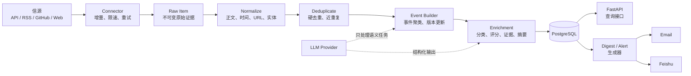

# AI × Security 情报后端 MVP 设计方案

> 版本：v0.1  
> 状态：实施基线  
> 最后更新：2026-07-28  
> 相关文档：[完整目标蓝图](./system-design.md) · [信源注册表](./source-registry.md)

## 1. 已确认的产品与技术决策

| 决策 | MVP 选择 |
|---|---|
| 产品核心 | 后端情报服务，而不是新闻网站或纯 Skill |
| 第一批用户 | 单个用户或小范围可信内部用户 |
| 主要出口 | 每日日报、紧急告警、只读查询 API |
| 首发渠道 | 邮件、飞书 |
| 网站 | 暂不建设；API 文档和数据库管理工具不算产品网站 |
| Agent / Skill | 暂不作为核心；后续通过 API/MCP 接入 |
| 架构 | 模块化单体，API 与 Worker 分进程运行 |
| 开发语言 | Python 3.13 |
| 数据库 | PostgreSQL 18；托管环境不支持时使用 PostgreSQL 17 |
| 开发环境 | Windows 11 主机 + WSL2 Ubuntu 24.04 LTS |
| 部署环境 | Linux VM + Docker Compose |

当本文与完整目标蓝图发生冲突时，MVP 实现以本文为准。

## 2. MVP 目标

在无人值守的情况下持续完成：

1. 从第一批信源增量获取内容。
2. 保存可回放的原始证据和采集状态。
3. 标准化、硬去重并形成事件候选。
4. 将事件分类到四条主线。
5. 生成带来源、可信度和行动建议的中文日报。
6. 将日报投递到邮件和飞书。
7. 对少量满足硬规则的事件发送紧急告警。
8. 通过 API 查询事件、日报和信源健康状态。

### 2.1 四条内容主线

- `ai`
- `ai_for_security`
- `ai_enabled_threats`
- `security_for_ai`

### 2.2 MVP 不做

- 不做公开网站、用户注册、付费订阅和 SEO。
- 不做面向任意用户的多租户权限系统。
- 不接入全部候选信源。
- 不依赖个人微信机器人。
- 不开放 Agent 自由浏览、自由执行或自由发布。
- 不自动执行 PoC、Notebook、模型文件和附件。
- 不建设知识图谱数据库、Kafka、Kubernetes 或微服务。
- 不把向量检索、LangChain 或多 Agent 作为基础依赖。
- 不要求一次解决所有中文全文搜索问题。

## 3. MVP 验收标准

连续运行 7 天并满足：

| 指标 | 目标 |
|---|---:|
| P0 结构化来源采集成功率 | 不低于 98% |
| 网页型来源解析成功率 | 不低于 90% |
| 日报 Top 10 人工相关率 | 不低于 80% |
| 日报重复事件率 | 低于 5% |
| 已发布事件原始链接覆盖率 | 100% |
| 高风险事件一手/权威来源覆盖率 | 100% |
| 日报按时生成率 | 不低于 99% |
| 邮件、飞书投递成功率 | 不低于 99% |
| 进程重启后的重复推送 | 0 |
| 采集内容导致命令或代码执行 | 0 |

网页解析成功指标题、发布时间、正文或结构化事实达到该来源的最低发布要求；仅成功返回 HTTP 200 不算解析成功。

## 4. 逻辑架构



### 4.1 运行进程

同一代码库和同一 Docker 镜像，以不同启动命令运行：

| 进程 | 职责 | 是否对外开放 |
|---|---|---:|
| `api` | 事件、日报、告警和健康查询 | 是，默认仅内网 |
| `worker` | 调度、采集、解析、聚类、摘要和投递 | 否 |
| `postgres` | 数据、状态、幂等和审计 | 否 |
| `playwright` | 动态网页兜底，按 Compose Profile 启用 | 否 |

MVP 只有一个 `worker` 实例。即使如此，任务也必须使用数据库幂等键和租约，保证重启或误启动第二实例时不会重复处理。

### 4.2 模块边界

```text
domain          事件、证据、信源、日报等领域模型
connectors      协议级采集器
parsers         信源解析 Profile 与少量专属 Hook
pipelines       标准化、去重、聚类、分类、评分、摘要
repositories    PostgreSQL 数据访问
jobs            调度任务和运行租约
delivery        邮件、飞书及投递幂等
llm             模型供应商适配器和结构化输出
api             FastAPI 路由与 Schema
```

模块之间通过 Python 接口和领域对象调用，不拆成网络微服务。

## 5. 信源与 Connector 设计

### 5.1 接入优先级

固定使用：

```text
官方 API
→ RSS/Atom
→ GitHub API
→ 静态网页适配器
→ 动态浏览器
→ 搜索/社区发现
```

搜索和社区只能发现线索，不能单独形成高置信事件。

### 5.2 Connector 接口

```python
class Connector:
    async def poll(self, endpoint, checkpoint) -> list[RawItem]:
        ...

    async def health(self, endpoint) -> SourceHealth:
        ...
```

解析与传输分离：

```text
Connector：负责请求、分页、限速、游标和响应
Parser：负责把响应映射成 NormalizedDocument
```

第一版只实现：

1. `RSSConnector`
2. `RestApiConnector`
3. `GitHubConnector`
4. `WebListConnector`

`PlaywrightConnector` 保留接口和独立运行 Profile，但不作为首批来源的默认依赖。

### 5.3 Source Policy

每个 endpoint 通过 YAML 配置差异，不在调度代码中写站点判断：

```yaml
id: openai-news-rss
source_id: openai
enabled: true
connector: rss
parser: rss-default-v1
url: https://openai.com/news/rss.xml
trust_tier: A
priority: P0
language: en

schedule:
  interval_minutes: 30
  jitter_seconds: 120

fetch:
  timeout_seconds: 20
  max_response_bytes: 5242880
  max_redirects: 3
  requests_per_minute: 2

topics:
  - ai
  - security_for_ai
```

MVP Source Policy 至少包含：

- Connector 与 Parser 版本
- URL 和是否启用
- 优先级、可信度、语言
- 调度间隔和随机抖动
- 超时、限速、重定向和响应大小
- 主题范围
- robots/条款审核状态
- checkpoint 类型
- 连续失败阈值

### 5.4 第一批 18 个 endpoint

#### 结构化优先

1. AI HOT API/RSS
2. OpenAI News RSS
3. arXiv API
4. GitHub Global Security Advisories
5. GitHub Releases：只跟踪 Watchlist 仓库
6. OSV API
7. NVD API/Feed
8. CISA KEV
9. FIRST EPSS

#### 官方网页适配器

10. Anthropic Newsroom
11. Anthropic Research
12. Google DeepMind
13. Hugging Face Blog
14. Qwen Blog
15. DeepSeek API Changelog
16. AIVD
17. CNVD AI
18. Microsoft Security Response Center

第一批的目标是验证四类 Connector、中文/英文处理和四条内容主线，不代表最终内容覆盖完整。MITRE ATLAS、OWASP、NIST 等在 MVP 中作为低频参考数据和映射词表，不按新闻源高频轮询。

## 6. 采集与处理流程

### 6.1 增量采集

每个 endpoint 保存：

- `etag`
- `last_modified`
- `cursor`
- `last_published_at`
- `last_fetched_at`
- `content_hash`
- `consecutive_failures`
- `next_run_at`
- `lease_until`

处理顺序：

```text
领取 endpoint 租约
→ 带 checkpoint 请求
→ 写入 Raw Item
→ 提交事务
→ 推进 checkpoint
→ 释放租约
```

必须先保存 Raw Item，再推进 checkpoint，避免进程崩溃造成数据永久遗漏。

### 6.2 原始证据

`RawItem` 至少保存：

- 来源和 endpoint
- 来源原生 ID
- 请求 URL、最终 URL
- HTTP 状态和必要响应头
- 发布时间和采集时间
- 原始语言
- 原始文本或受控快照
- SHA-256 内容哈希
- Connector 和 Parser 版本

原始内容不可变；修正通过新版本完成。

### 6.3 标准化

输出统一 `NormalizedDocument`：

- 原文标题
- 中文标题
- 正文文本
- canonical URL
- 作者和机构
- 原始发布时间及 UTC 时间
- 语言
- CVE、GHSA、CNVD、CNNVD、CWE
- 公司、模型、产品、仓库、包和版本
- 原始元数据

### 6.4 去重与事件聚类

MVP 分三步：

1. 硬去重：来源原生 ID、canonical URL、内容哈希。
2. 近重复：标准化标题、RapidFuzz、SimHash。
3. 事件候选：时间窗、共享实体、事件类型、语义相似度。

强合并键：

- 相同 CVE/GHSA/CNVD/CNNVD。
- 相同模型、版本和发布类型。
- 相同公司、事故类型和相近时间。

规则先生成候选；LLM 只处理边界模糊的候选。高风险事件合并置信度不足时，保留为独立事件并标记 `review_needed`。

### 6.5 事件更新

同一事件的新文章不生成新卡片，而是：

- 增加证据来源。
- 更新置信度。
- 更新生命周期。
- 生成新的事件版本。

只有以下变化允许重新推送：

- `reported → confirmed`
- `poc_public → exploited_in_wild`
- `unpatched → patched`
- 风险等级显著提高
- 原结论被更正或撤回

## 7. 事实、评分与 LLM 边界

### 7.1 证据等级

| 等级 | 定义 |
|---|---|
| A | 官方公告、权威漏洞库、论文原文、项目 Release |
| B | 可信研究团队或多个独立专业来源 |
| C | 单一媒体、个人研究者、社区线索 |
| D | 无法定位原文的传闻、截图或二次转载 |

高风险告警至少需要一个 A 级来源，或一个 B 级研究来源加独立验证。

### 7.2 评分

```text
relevance       0-30
impact          0-20
evidence        0-20
novelty         0-10
corroboration   0-10
actionability   0-10
```

同时单独保存：

- `confidence`
- `urgency`
- `personal_relevance`

### 7.3 LLM 可以做

- 四条主线和事件类型分类
- 实体别名建议
- 模糊事件聚类建议
- 影响分析
- 中文摘要
- 不确定性表述
- MITRE ATLAS、OWASP 等映射建议

### 7.4 LLM 不可以做

- 覆盖 CVE/GHSA/KEV/EPSS/CVSS 等权威字段
- 修改原始 URL 和发布时间
- 决定是否执行代码或附件
- 在无证据时把 `reported` 改成 `confirmed`
- 直接修改已发布事件而不产生版本

所有 LLM 输出：

- 使用 Pydantic Schema 校验。
- 保存模型、Prompt 版本和输入哈希。
- 按输入哈希缓存。
- 校验失败时重试一次，仍失败则进入降级流程。

模型不可用时，采集、标准化和硬去重继续运行；日报可以延迟或生成事实字段版，不能丢弃原始数据。

## 8. 最小数据模型

| 表 | 关键内容 |
|---|---|
| `sources` | 名称、可信度、语言、机构 |
| `source_endpoints` | Connector、Parser、URL、Policy、checkpoint、健康状态 |
| `fetch_runs` | 开始结束时间、状态、数量、错误、租约 |
| `raw_items` | 原始证据、哈希、请求元数据、版本 |
| `documents` | 标准化正文、标题、时间、标识符和实体 JSON |
| `events` | 类型、主线、标题、摘要、状态、评分、当前版本 |
| `event_documents` | 事件与文档关系、支持/反对、来源等级 |
| `digests` | 日期、状态、生成版本和目标 Profile |
| `digest_items` | 排序、栏目、事件、摘要版本 |
| `delivery_runs` | 渠道、目标、幂等键、状态、错误和时间 |
| `feedback` | 事件、反馈类型和备注 |

MVP 不建立独立图数据库。实体和框架映射先存规范字段与 JSONB；确认查询模式后再规范化为更多关系表。

关键唯一约束：

```text
raw_items(endpoint_id, native_id)
raw_items(endpoint_id, canonical_url, published_at)
delivery_runs(channel, target, payload_hash)
event_documents(event_id, document_id)
```

## 9. API

### 9.1 公开给可信客户端的只读接口

```http
GET /health
GET /v1/events
GET /v1/events/{event_id}
GET /v1/digests/daily
GET /v1/digests/{date}
GET /v1/alerts
GET /v1/sources/health
```

查询条件至少支持：

- 时间范围
- 四条主线
- 事件类型
- 最低分数
- 可信度
- 实体/CVE/仓库关键词

### 9.2 写接口

```http
POST /v1/feedback
```

管理操作首期使用 CLI，不开放公网管理 API：

```text
intel source list
intel source enable <id>
intel source disable <id>
intel source poll <id>
intel digest generate <date>
intel digest deliver <date> --channel feishu
intel event reprocess <id>
```

## 10. 调度与任务

| 任务 | 默认频率 |
|---|---:|
| KEV、GHSA 等高优先级结构化源 | 15～30 分钟 |
| 官方 RSS | 30 分钟 |
| 常规 API | 30～60 分钟 |
| 官方网页适配器 | 2 小时 |
| arXiv | 6 小时 |
| 重新处理失败任务 | 指数退避 |
| 日报冻结窗口 | 北京时间 07:30 |
| 日报投递 | 北京时间 08:30 |
| 数据保留与健康汇总 | 每日一次 |

APScheduler 只负责触发高层任务，例如 `collect_due_sources`。每个 endpoint 的真实到期时间、租约和运行结果保存在 PostgreSQL，不能只依赖 Scheduler 内存状态。

## 11. 日报和告警

### 11.1 日报结构

```text
今日最重要的 3～5 条
AI
AI for Security
AI-enabled Threats
Security for AI
值得关注但尚未确认
信源与系统状态摘要
```

单条事件：

```text
标题
发生了什么
为什么重要
影响对象
证据与不确定性
建议行动
原始来源
```

### 11.2 紧急告警候选

- `KEV=true` 且命中固定资产/框架清单。
- 官方确认重要 AI 服务安全事故。
- 公开可利用的 AI/Agent RCE、鉴权绕过或凭证泄露。
- 生命周期升级为 `exploited_in_wild`。
- 已推送事件出现重要更正或撤回。

MVP 使用配置文件维护单个默认 Profile 和固定关注清单，不建设完整用户偏好系统。

### 11.3 投递适配器

统一接口：

```python
class DeliveryAdapter:
    async def send(self, target, payload, idempotency_key) -> DeliveryResult:
        ...
```

第一版：

- `EmailDelivery`
- `FeishuWebhookDelivery`

需要私聊、交互卡片和用户身份后，再增加 `FeishuAppDelivery`。

## 12. 技术栈

| 类别 | MVP 选择 |
|---|---|
| Python | Python 3.13 |
| 项目与依赖 | uv、`pyproject.toml`、`uv.lock` |
| API | FastAPI、Pydantic 2、Uvicorn |
| 数据库 | PostgreSQL 18 |
| 数据访问 | SQLAlchemy 2、Alembic、Psycopg 3 |
| 调度 | APScheduler，使用持久化 Data Store |
| 网络 | HTTPX AsyncClient |
| RSS | feedparser |
| HTML | lxml、Trafilatura |
| 动态网页 | Playwright，按需启用 |
| 重试 | Tenacity |
| 相似度 | RapidFuzz、SimHash；向量暂不作为必需项 |
| 模板 | Jinja2 |
| 日志 | 标准库 Logging 输出 JSON；需要时再引入 structlog |
| 测试 | pytest、pytest-asyncio、respx |
| 质量 | Ruff、Pyright |
| 部署 | Docker Compose |

技术依据：

- [FastAPI](https://fastapi.tiangolo.com/) 与 Pydantic 适合类型化 API 和自动 OpenAPI。
- [SQLAlchemy 2](https://docs.sqlalchemy.org/en/20/) 支持同步和异步数据访问。
- [PostgreSQL 版本策略](https://www.postgresql.org/support/versioning/)为长期维护提供明确周期。
- [APScheduler](https://apscheduler.readthedocs.io/en/master/userguide.html)支持持久化任务存储。
- [Trafilatura](https://trafilatura.readthedocs.io/en/stable/)用于网页正文和元数据抽取。
- [Playwright Python](https://playwright.dev/python/docs/intro)只作为动态页面兜底。

### 12.1 明确不引入

MVP 不引入：

- Redis
- Celery/Dramatiq
- Kafka
- Elasticsearch/OpenSearch
- 独立向量数据库
- LangChain/LangGraph
- Kubernetes
- React/Next.js

## 13. 代码结构

```text
src/
└── ai_security_hot/
    ├── api/
    ├── cli/
    ├── config/
    ├── connectors/
    ├── parsers/
    ├── pipelines/
    ├── domain/
    ├── repositories/
    ├── jobs/
    ├── delivery/
    ├── llm/
    ├── models/
    └── main.py

sources/
├── sources.yaml
└── parsers/

tests/
├── fixtures/
├── connectors/
├── parsers/
├── pipelines/
├── api/
└── integration/

migrations/
compose.yaml
Dockerfile
pyproject.toml
uv.lock
```

Parser 的历史响应样本放在 `tests/fixtures/`，不得在测试时依赖真实网站。

## 14. Windows 开发与 Linux 部署

### 14.1 推荐方式

```text
Windows 11
→ WSL2 Ubuntu 24.04 LTS
→ 代码存放于 WSL Linux 文件系统
→ uv/Python/Git 在 WSL 内运行
→ Docker Desktop 使用 WSL2 Backend
```

不要在同一项目混用 Windows Python 和 WSL Python。

### 14.2 开发循环

快速开发：

```text
PostgreSQL：Docker
API：WSL 中 uv run
Worker：WSL 中 uv run
测试：WSL 中 uv run pytest
```

发布前：

```text
docker compose build
docker compose up
执行数据库迁移
执行单元和集成测试
执行一轮固定 Fixture 采集回放
```

### 14.3 跨平台约束

- 使用 `pathlib`，禁止硬编码 Windows/Linux 绝对路径。
- 代码、YAML、Dockerfile 和 Shell 使用 LF。
- 模块和文件名大小写必须一致。
- 数据库存 UTC，调度显式使用 `Asia/Shanghai`。
- PostgreSQL 使用 Docker Named Volume。
- CI 至少在 Linux 上运行。

## 15. 安全边界

### 15.1 URL 获取

- 仅允许 HTTP(S)。
- 阻止 localhost、私网、link-local 和云元数据地址。
- DNS 解析前后都检查目标 IP。
- 限制重定向次数、响应大小、超时和内容类型。
- 默认不执行 JavaScript。
- 按 endpoint 配置域名允许列表。

### 15.2 内容处理

- HTML、论文、Issue、PoC 和模型卡均为不可信输入。
- 不将网页内容拼接进系统级指令。
- 不运行网页中的命令、代码、宏和 Notebook。
- 不自动下载附件。
- PDF、压缩包和模型文件留到隔离处理扩展阶段。

### 15.3 凭据

- 数据库、LLM、邮件和飞书凭据来自 Secret/环境变量。
- 不进入日志、Prompt、原始证据或 API 响应。
- 查询 API 使用单独只读 Token；反馈接口使用权限受限的独立写 Token。
- 管理 CLI 只在服务器或可信内网使用。

## 16. 测试和可观测性

### 16.1 必须测试

- 每种 Connector 的分页、增量和限速。
- ETag/Last-Modified 和 checkpoint 恢复。
- 每个网页 Parser 的历史 Fixture。
- URL 规范化和硬去重。
- 事件强合并键。
- LLM Schema 校验失败和降级。
- 投递幂等、重试和更正通知。
- Worker 中断后重新启动。
- SSRF、重定向、超大响应和恶意 HTML。

### 16.2 最小指标

- `fetch_success_total`
- `fetch_failure_total`
- `parse_success_total`
- `documents_created_total`
- `documents_deduplicated_total`
- `events_created_total`
- `events_updated_total`
- `llm_calls_total`
- `llm_validation_failure_total`
- `delivery_success_total`
- `delivery_failure_total`
- 每个 endpoint 的最后成功时间和连续失败次数

MVP 使用 JSON 日志和 `/health`、`/v1/sources/health`。需要跨进程指标和告警后再增加 Prometheus/OpenTelemetry。

## 17. 实施里程碑

### M0：工程骨架

- 建立 Python 项目、Docker Compose 和 PostgreSQL。
- 建立领域对象、数据库迁移和配置加载。
- 实现 `api`、`worker`、健康检查和 CLI 骨架。
- 建立测试、Lint、类型检查和 Linux CI。

完成标准：空系统可启动、迁移、调度、查询健康状态。

### M1：结构化采集

- RSS、REST API、GitHub Connector。
- 接入前 9 个结构化 endpoint。
- Raw Item、checkpoint、幂等和采集健康。
- 使用 Fixture 完成 Connector 测试。

完成标准：重启不漏采、不重复写入，可查看采集历史。

### M2：事件情报

- 标准化和硬去重。
- 近重复和事件候选。
- 四条主线分类。
- 评分、证据等级和结构化摘要。
- 接入首批官方网页适配器。

完成标准：能够通过 API 获得带证据的事件列表。

### M3：日报与推送

- 日报冻结、生成和版本化。
- 邮件、飞书模板。
- 投递幂等和失败重试。
- 少量硬规则紧急告警。

完成标准：连续 7 天达到第 3 节验收指标。

## 18. 后续扩展方向

### 18.1 信源扩展

- 增加安全实验室、政策、论文和国内来源。
- 增加 PDF/OCR 隔离处理。
- 为少量高价值动态网站启用 Playwright。
- 建立 Parser 漂移检测和 Shadow Run。

### 18.2 个性化与 Agent

- 多 Profile 和 Watchlist。
- 用户角色化摘要。
- 提供 MCP Server。
- 发布轻量 `ai-security-intel` Skill。
- 接入 Hermes/OpenClaw 进行对话和多渠道路由。

Agent 只通过受限 API/MCP 使用情报能力，数据库仍是唯一事实源。

### 18.3 网站

只有明确出现以下需求时建设：

- 高频历史搜索和筛选。
- 事件时间线、证据对照和收藏。
- 团队审核与协作。
- 公开传播、SEO、订阅或商业化。

网站优先做内部事件工作台，再决定是否做公开门户。

### 18.4 基础设施

| 出现的实际问题 | 再引入 |
|---|---|
| 单 Worker 积压，需要多实例并发 | Redis + Celery/Dramatiq，或其他持久队列 |
| 原始快照影响数据库备份 | S3/MinIO |
| 语义查询成为核心需求 | pgvector |
| PostgreSQL 搜索无法满足复杂检索 | OpenSearch/Elasticsearch |
| 模块需要独立扩缩容和团队所有权 | 拆分微服务 |
| 多服务事件量达到消息总线级别 | Kafka |
| 多节点部署和自动扩缩容成为刚需 | Kubernetes |

扩展必须由实际指标触发，不能仅因为“以后可能需要”提前引入。

## 19. 开发前仍需确认

1. 第一批日报接收者和飞书目标是个人、群还是机器人 Webhook。
2. 邮件使用 SMTP 还是事务邮件服务。
3. 首选 LLM Provider 和单日费用上限。
4. 第一批 GitHub Watchlist 仓库。
5. 紧急告警的固定资产/产品清单。
6. 第一批 18 个 endpoint 是否需要替换或增加中文来源。

这些配置不改变总体架构，但会决定第一轮 Connector、模板和验收数据。
