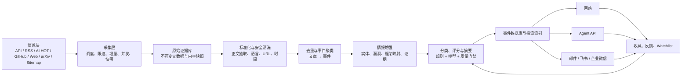

# AI × Security 情报系统整体框架设计

> 状态：完整目标蓝图 / 后续演进参考
> 最后更新：2026-07-31
> 定位：完整目标蓝图；不是第一版的全部实施范围
> 当前实施基线：[项目当前状态与后续路线](./current-status.md) · [后端 MVP 设计方案](./mvp-design.md)
> 配套文档：[信源注册表](./source-registry.md) · [M1 增量与分类](./m1-data-pipeline.md) · [M2 事件情报](./event-intelligence.md)
> 当前已完成：M0 骨架 + M1.1/M1.2.x/M1.3 + M2.1 可扩展事件情报底座 + M2.2 影子基础及首轮 100 篇实验（19 个 endpoint 配置：18 active + 1 retired；17 source，8 类 Connector）

第一版实现以《后端 MVP 设计方案》为准。本文保留网站、Agent、完整证据模型、团队版和长期扩展设计，用于约束后续演进方向。

## 1. 产品目标

系统不是新闻搬运站，而是一个面向 AI 与安全从业者的“可行动事件情报层”：

> 持续跟踪 AI、AI for Security、AI-enabled Threats、Security for AI，合并同一事件的多篇报道，解释影响和可信度，生成可检索、可问答、可推送的个性化情报。

三个产品出口共用同一数据底座：

- 网站：归档、搜索、证据、事件时间线、Watchlist。
- Agent：自然语言查询、对比、个性化解释、日报生成。
- 推送：邮件、飞书、企业微信；后续再扩展公众号。

### 1.1 MVP 成功标准

- Top 10 人工抽检相关率不低于 80%。
- 同一事件的重复卡片率低于 5%。
- 高优先级事件的一手来源覆盖率不低于 70%。
- 所有已发布事件都能追溯到至少一个原始链接。
- 高风险告警不存在“只有媒体转述、没有一手证据”却标为已确认的情况。
- 抓取内容中的提示词、命令、PoC 不会被系统执行。
- 邮件、飞书推送具备幂等、重试和投递审计。

### 1.2 MVP 暂不做

- 不复制或展示第三方完整正文。
- 不自动执行 PoC、恶意样本或漏洞复现。
- 不做开放式“Agent 自由上网并自行决定发布”的流程。
- 不依赖非官方个人微信机器人。
- 不一开始接入上百个来源。
- 不把向量相似度或 LLM 主观分数当作唯一事实判断。

## 2. 内容分类框架

### 2.1 四条一级主线

#### A. AI

- 模型发布与能力变化
- Agent 与开发工具
- 多模态、语音、视频、机器人
- 训练、推理、芯片和算力
- 论文、基准和开源
- 产品、公司、融资与生态
- 政策、标准与治理

#### B. AI for Security

- AI SOC、告警分析和调查
- 威胁检测与响应
- 漏洞发现、代码审计和修复
- 恶意软件分析
- 钓鱼、欺诈和深伪检测
- 威胁情报生成与关联
- 身份、数据和云安全
- AI 安全产品、融资和落地案例

#### C. AI-enabled Threats

- AI 辅助社工与钓鱼
- 深伪、身份冒用和舆论操纵
- AI 生成恶意代码
- 自动化漏洞利用与攻击链
- AI 驱动欺诈和黑产
- 模型辅助生物、化学或其他双重用途风险
- 攻击组织和犯罪生态使用 AI 的证据

#### D. Security for AI

- Prompt Injection / Indirect Prompt Injection
- Jailbreak / Safety Bypass
- Agent、工具和 MCP 安全
- RAG、记忆和上下文投毒
- 训练数据与模型投毒
- 模型窃取、提取和蒸馏攻击
- 模型文件、依赖与供应链
- 隐私、敏感信息和训练数据泄露
- 不安全输出处理和代码执行
- 过度权限、身份与授权
- 推理 API、算力滥用和拒绝服务
- 对齐、可解释性、红队和安全评测
- 治理、标准、合规和事故

### 2.2 正交标签

一级主线之外，所有事件还要附加以下正交维度：

- `event_type`：release、vulnerability、incident、research、policy、funding、opinion、tool。
- `lifecycle`：rumor、reported、demonstrated、poc_public、weaponized、exploited_in_wild、patched、retracted。
- `asset_type`：model、agent、mcp_server、framework、dataset、api、cloud_service、endpoint、identity、dependency。
- `audience`：AI 开发者、安全团队、管理层、研究人员、政策/合规、普通用户。
- `region`：CN、US、EU、UK、Global 等。
- `framework_mapping`：MITRE ATLAS、OWASP GenAI、CWE、CVE、ATT&CK、NIST AI RMF。
- `evidence_level`：A/B/C/D，见第 7 节。

## 3. 逻辑架构



核心设计原则是：

1. `Source Item` 和 `Event` 分离。一篇文章只是证据，同一事件可以有多篇文章。
2. 原始数据不可变，任何摘要、分类和合并都可以回放。
3. 规则负责硬事实，LLM 负责语义理解；LLM 不能覆盖权威字段。
4. 重要性与可信度分开计算。
5. 发布、修改、更正和撤稿全部版本化。

## 4. 采集层设计

### 4.1 Connector 类型

统一 Connector 接口：

```text
poll(checkpoint) -> Batch<RawItem>       # 同步连接器
apoll(checkpoint) -> Batch<RawItem>      # 异步连接器（Sitemap）
normalize(raw_item) -> NormalizedDocument
health() -> SourceHealth
```

已实现八类 Connector：

1. `RSSConnector`（sync `poll`）
2. `RestApiConnector`（sync `poll`，通用分页、修订与权威快照删除）
3. `NvdConnector`（sync `poll`，modified-time 密度缩窗 + durable catch-up cursor）
4. `AIHotConnector`（sync `poll`，snapshot/changes/remove/409 rebuild）
5. `GitHubConnector`（sync `poll`）
6. `WebListConnector`（sync `poll`）
7. `ArxivConnector`（sync `poll`）
8. `SitemapConnector`（async `apoll`，列表页快速发现 + Sitemap 重叠对账 → 并发抓取原文）

`playwright` 目前只保留枚举和 Compose Profile 运行位；尚无 `PlaywrightConnector` 与浏览器镜像，属于未来动态网页兜底能力。

FetchContext 提供：
- 同步 `get()`：传统连接器使用，统一执行请求启动限速、重试、超时和流式大小限制。
- 异步 `aget()`：Sitemap 等并发连接器使用；单轮 pipeline 复用连接池，共享线程安全的严格请求启动限速器。

并发 fetch pipeline：
- `run_fetch_stage()` 使用 `asyncio.gather` + `Semaphore(5)` 并发处理多个 endpoint。
- 同步连接器通过 `run_in_executor` 调度，异步连接器直接 `apoll()`；正文抽取等同步 CPU 工作通过线程池执行。

每个 endpoint 配置：

```yaml
id: openai-news-rss
source_id: openai
connector: rss
url: https://openai.com/news/rss.xml
trust_tier: A
priority: P0
poll_interval_minutes: 30
language: en
allowed_topics:
  - ai
  - security_for_ai
rate_limit:
  requests: 2
  per_seconds: 60
```

### 4.2 调度建议

| 来源类型 | 默认间隔 | 说明 |
|---|---:|---|
| CISA KEV / 高危漏洞 API | 15 分钟 | 使用 ETag/Last-Modified，避免重复下载 |
| GitHub Advisory / P0 Releases | 15～30 分钟 | 按 `updated_since` 或时间窗增量 |
| 官方厂商 RSS | 30 分钟 | 新闻更新不需要秒级 |
| 研究博客 / 论文 | 2～6 小时 | 每日多次即可 |
| 国内网页适配器 | 1～6 小时 | 依据稳定性和访问限制 |
| 媒体 / 社区 | 30～60 分钟 | 只做发现和热度 |
| 日报生成 | 北京时间 07:30 | 预留复核与推送时间 |
| 日报投递 | 北京时间 08:30 | 用户可自定义 |

### 4.3 增量与幂等

每个 endpoint 保存：

- ETag
- Last-Modified
- cursor / page token
- last successful published/content watermark
- last successful fetched time
- **last_success_at**（上次成功推进时间，用于 NVD 重叠时间窗）
- content hash
- consecutive failure count
- endpoint status / replacement endpoint / retired time

增量过滤优先级：

1. **API/水位增量**：NVD 使用 durable 分片 cursor、密度缩窗和稳态 overlap；Sitemap 使用独立内容水位与重叠对账。
2. **known content 过滤**：Checkpoint 携带 `native_id → content_hash`；未变化内容在 Connector 层跳过，修订内容生成新版本。
3. **HTTP 级增量**：ETag/304，部分源有效（CISA），部分源几乎不返回 304（arXiv）。
4. **DB 级幂等兜底**：`ON CONFLICT DO NOTHING` on `(endpoint_id, native_id, content_hash)`；同 ID 内容变化保留新版本。

幂等键优先级：

1. 来源原生 ID + 内容指纹（不可变内容版本）。
2. Canonical URL + 发布时间 + 内容指纹。
3. 标准化 URL。

当前实现用 SourceRecord 保存源端当前投影，并从其中构造有界 known-content 映射；DB 唯一约束覆盖全历史。AI HOT 使用完整 snapshot + durable changes 并支持撤回/409 重建，旧 RSS 通过 `replaced_by` 退役；CISA 作为权威快照检测删除；NVD 使用 120 天 durable 分片 bootstrap/catch-up、15 分钟稳态重叠，并把上游 `vulnStatus` 映射为 published/rejected/withdrawn/unknown；Anthropic 使用 Newsroom + 每日 72 小时 Sitemap 对账。当前视图统一要求来源 active 且上游记录不是 Rejected/Withdrawn。RSS/arXiv 仍受上游窗口限制。完整契约见 [M1 增量与分类](./m1-data-pipeline.md)。

## 5. 原始内容与安全边界

采集内容可能包含 Prompt Injection、恶意 HTML、追踪链接、PoC 或恶意附件。采集层必须与执行环境隔离。

### 5.1 强制规则

- 禁止执行网页 JavaScript、Shell、Python、宏、Notebook 和 PoC。
- 禁止把采集内容拼接为系统级提示词。
- LLM 输入采用清晰的数据边界，例如 `<untrusted_document>...</untrusted_document>`。
- 文档中的“忽略之前指令”“上传文件”“发送密钥”等只作为待分析文本。
- 禁止自动下载附件；PDF/压缩包/模型文件进入单独的隔离流程。
- URL 获取器必须防 SSRF：阻止 localhost、私网、link-local、云元数据地址和非 HTTP(S) 协议。
- 限制响应大小、重定向次数、内容类型和解压后大小。
- HTML 做脚本、事件属性、iframe 和危险协议清洗。
- 所有外部链接在展示层添加安全跳转和来源提示。

### 5.2 原始数据保留

建议保存：

- 请求 URL、最终 URL、HTTP 状态、响应头摘要。
- 原始发布时间、采集时间。
- 文本正文、标题、作者和结构化元数据。
- 内容哈希。
- 解析器版本。
- 必要时保存受版权限制的内部快照，但不对外展示；保留周期按条款设置。

## 6. 标准化、去重与事件聚类

### 6.1 标准化

- URL 去除 UTM、分享参数和无意义 query。
- 时间统一存 UTC，同时保留原始时区。
- 标题保留原文，另外生成中文标题和英文标题。
- 识别语言、作者、机构、来源类型。
- 抽取 CVE、GHSA、CNVD、CNNVD、CWE、模型名、版本、仓库、公司和攻击组织。
- 标准化实体别名，例如 `Claude Code`、`claude-code`、仓库名映射为同一实体。

### 6.2 三层去重

#### 第一层：文档级硬去重

- canonical URL 相同；但共享目录 URL 下互斥的 CVE/GHSA/CNVD 不能合并。
- 来源原生 ID 相同。
- 内容哈希相同。
- CVE/GHSA + 来源相同。

#### 第二层：近重复

- 标准化标题 token/Jaccard。
- SimHash/MinHash。
- 同一来源短时间内的更新稿。

#### 第三层：事件聚类

候选事件必须同时满足：

- 时间接近，默认 72 小时；政策、研究可放宽。
- 共享关键实体，例如模型、厂商、CVE、产品。
- 语义相似度达到阈值。
- 事件类型不冲突。

关键硬键：

- CVE/GHSA/CNVD/CNNVD 相同：强合并候选。
- 同一模型 + 同一版本 + 发布：强合并候选。
- 同一公司 + 同一事故 + 相近时间：强合并候选。

模型只提出“合并建议”；当事件类型、版本或时间明显冲突时由规则拒绝。高风险事件的错误合并和错误拆分都进入人工复核队列。

当前 M2.1 已实现持久化 URL/标题/正文 hash、RapidFuzz 自动规则、SimHash/MinHash 候选、稳定重复组件、局部候选/事件图重算，以及 CVE/GHSA/CNVD/arXiv/GitHub release/模型或包发布/事故/campaign 强键。低置信候选可人工裁决，强身份冲突不能被相似度或人工批准越过；EventVersion、Claim 和支持/反驳 Evidence 已落库。M2.2 已完成非 CVE 影子抽取和分层实验并补齐逐次调用审计；M2.3 已升级为有界、版本化、可恢复的持久候选队列，并用 generation-fenced 局部闭包物化稳定 relation component/revision/历史 membership；M2.4 按稳定 component key 显式正式提升并安全回滚。默认关闭的可移植 Embedding 有界召回已实现；pgvector ANN 与 LLM 关系裁决仍未实现；详见 [当前状态与路线](./current-status.md) 和 [M2 事件情报](./event-intelligence.md)。

### 6.3 事件更新而非重复发布

同一事件新增来源时：

- 更新证据数量和来源列表。
- 根据新证据调整置信度和生命周期。
- 保留旧版本。
- 只有重要状态变化才重新推送，例如 `reported → confirmed`、`poc_public → exploited_in_wild`、`unpatched → patched`。

## 7. 证据、可信度与事实模型

### 7.1 Claim-Evidence 模型

一个事件由多条 Claim 组成：

```text
Claim: 某漏洞影响 Langflow 1.2.0 以前版本
Evidence 1: 厂商安全公告
Evidence 2: GitHub Advisory
Evidence 3: 媒体转述
```

每条 Claim 记录：

- 陈述文本
- 结构化字段
- 支持证据和反对证据
- 来源片段位置
- 首次出现时间
- 当前状态：supported、disputed、unverified、retracted
- 生成/修改该 Claim 的规则或模型版本

### 7.2 证据等级

| 等级 | 定义 | 示例 |
|---|---|---|
| A | 权威一手、可验证结构化数据 | 官方公告、CVE/GHSA、监管文件、论文原文、项目 Release |
| B | 多个独立专业来源或可信研究团队 | 安全实验室复现、多个独立研究报告 |
| C | 单一媒体、社区或未经厂商确认的研究 | 媒体独家、个人研究者、社交媒体 |
| D | 传闻、截图、无法定位原文 | 不进入正式日报 Top 区，只进观察区 |

事件置信度不能仅由来源数量决定；十篇转载仍可能只有一个原始来源。

### 7.3 更正与撤稿

事件状态：

```text
detected -> enriched -> review_needed -> published
published -> updated
published -> corrected
published -> retracted
```

更正后：

- 页面显示更正时间和原因。
- 已发送的高影响错误信息需要发送更正通知。
- 不删除历史版本，但普通用户默认看到最新版本。

## 8. 情报增强

### 8.1 漏洞增强

对 CVE/GHSA/CNVD/CNNVD 关联：

- CVSS v3/v4
- EPSS 与百分位
- CISA KEV
- CWE
- 受影响包和版本
- 修复版本
- PoC 状态
- 在野利用状态
- 是否被勒索软件使用
- 资产/Watchlist 是否匹配

硬规则：

- `KEV=true` 不能被 LLM 改成 false。
- CVSS 高不等于紧急；必须结合 EPSS、KEV、可达性和用户资产。
- 媒体声称“已利用”但无可靠证据时只能标 `reported`。

### 8.2 AI 安全框架映射

- MITRE ATLAS：攻击技术和缓解措施。
- OWASP GenAI / Agentic / MCP：应用安全分类。
- NIST AI RMF：治理、测评和风险管理。
- CWE/CAPEC/ATT&CK：传统漏洞和攻击链补充。

映射同时保存：

- framework
- technique/control ID
- 映射置信度
- 映射理由
- 人工确认状态

### 8.3 实体图谱

核心实体：

- Organization
- Product
- Model
- Framework
- Repository
- Package
- Vulnerability
- Threat Actor
- Regulation
- Paper
- Benchmark
- Person

关系示例：

- `MODEL developed_by ORGANIZATION`
- `VULNERABILITY affects PACKAGE`
- `EVENT references PAPER`
- `MODEL evaluated_by BENCHMARK`
- `THREAT_ACTOR uses TECHNIQUE`
- `FRAMEWORK depends_on PACKAGE`

## 9. 分类与评分

### 9.1 当前 M1.3 分类实现

M1.3 已实现规则/模型硬边界、provider registry、严格 JSON Schema + Pydantic/taxonomy 白名单、模型缓存与逐次审计、分类租约 heartbeat/fencing、指数退避和规则 fallback。结构化 CVE 只走规则；模型只处理新闻/论文语义。fetch、normalize、fulltext、classify、event 使用独立调度，长窗口抓取与慢模型都不会阻塞其他阶段。详见 [M1 实现说明](./m1-data-pipeline.md)。

### 9.2 重要性分数

总分 0～100：

```text
relevance       0-30  与主题和用户 Watchlist 的相关性
impact          0-20  潜在或实际影响
evidence        0-20  证据质量
novelty         0-10  是否为真正新增信息
corroboration   0-10  独立信源印证
actionability   0-10  是否有明确可执行动作
```

系统还需要单独输出：

- `confidence`：证据置信度。
- `urgency`：是否需要立即行动。
- `personal_relevance`：对特定用户/团队的相关性。

这三个维度不能被总分替代。

### 9.3 告警硬规则

满足任一条件进入紧急告警候选：

- `KEV=true` 且命中用户资产。
- 官方确认安全事故且命中关注厂商/模型。
- 公开可利用的高影响 AI/Agent 远程代码执行、鉴权绕过或凭证泄露。
- 生命周期升级为 `exploited_in_wild`。
- 重要监管规则进入生效或强制执行阶段，且命中用户地区/行业。

以下情况不得直接紧急推送：

- 只有单一匿名爆料。
- 只有论文中的概念攻击，没有现实影响证据。
- 单纯 CVSS 高，但不命中资产且没有利用证据。
- 社区热度高但事实不明。

### 9.4 个性化

用户 Profile：

- 关注公司、模型、框架、仓库、CVE、攻击技术。
- 角色：安全研究员、AI 工程师、管理层等。
- 语言和摘要长度。
- 日报时间、安静时段、告警阈值。
- “相关/不相关/已知/希望深入”反馈。

初期使用显式配置和简单权重；数据足够后再学习偏好，避免黑盒推荐。

## 10. 摘要模板

### 10.1 通用事件

1. 发生了什么。
2. 为什么重要。
3. 对谁有影响。
4. 证据与不确定性。
5. 建议关注/行动。

### 10.2 漏洞事件

```text
标题
影响对象与版本
攻击前提
最高影响
利用状态
修复/缓解措施
CVSS / EPSS / KEV
证据来源
对 Watchlist 的命中情况
```

### 10.3 模型/产品发布

```text
发布内容
与上一版本的变化
公开可验证的基准
价格、许可、上下文、部署方式
安全与隐私变化
对开发者/安全团队的意义
```

### 10.4 论文

```text
研究问题
方法与主要发现
实验条件和限制
代码/数据是否开放
是否只是实验室结果
对应的 AI 安全技术和现实意义
```

### 10.5 政策/标准

```text
发布机构与司法辖区
文件状态：草案/征求意见/正式/生效
适用对象
关键义务与时间点
对 AI 产品和安全团队的影响
原文条款入口
```

## 11. 数据模型

建议使用 PostgreSQL，核心表如下：

### 11.1 信源与采集

- `sources`
- `source_endpoints`（含 active/paused/retired、replacement、retired_at）
- `source_checkpoints`
- `fetch_runs`
- `raw_items`
- `documents`（含本地 source_status 与上游 record_status 双轴生命周期）
- `document_versions`

### 11.2 事件与证据

- `events`
- `event_versions`
- `event_documents`
- `claims`
- `claim_evidence`
- `event_scores`
- `event_status_history`

### 11.3 实体与安全数据

- `entities`
- `entity_aliases`
- `event_entities`
- `vulnerabilities`
- `packages`
- `affected_versions`
- `framework_mappings`
- `tags`
- `event_tags`

### 11.4 用户与分发

- `users`
- `profiles`
- `watchlists`
- `watchlist_rules`
- `subscriptions`
- `digests`
- `deliveries`
- `delivery_attempts`
- `feedback`
- `saved_events`

### 11.5 审计

- `model_runs`
- `prompt_versions`
- `rule_versions`
- `review_tasks`
- `audit_logs`

关键约束：

- 原始文档不可原地覆盖。
- Event 每次发布生成版本。
- 任何 LLM 生成字段必须记录模型、提示版本、输入文档 ID 和时间。
- 删除来源文章时保留删除/撤稿记录，不继续展示受限内容。

## 12. 搜索与 Agent

### 12.1 搜索

混合检索：

- PostgreSQL 全文检索：标题、摘要、实体和编号。
- 精确检索：CVE、GHSA、版本、仓库、公司。
- pgvector：语义检索和事件聚类候选。
- 时间、主线、标签、证据等级、生命周期和风险过滤。

### 12.2 Agent 工具

Agent 只通过受控 API 访问事件库：

```text
search_events(query, filters, time_window)
get_event(event_id)
get_event_evidence(event_id)
compare_events(event_ids)
get_daily_digest(date, profile_id)
get_watchlist_updates(profile_id)
subscribe(rule)
submit_feedback(event_id, feedback)
```

Agent 默认不直接抓网页；发现证据不足时可以创建 `research_task`，由采集层按允许的来源和策略执行。

### 12.3 典型问题

- 过去 24 小时最重要的 5 个 Security for AI 事件是什么？
- 最近一周有哪些 Agent/MCP 漏洞有公开 PoC？
- 哪些事件影响我的 Dify、LangChain、Ollama 技术栈？
- 对比 OpenAI、Anthropic、Google 最近一个月的安全政策变化。
- 把今天日报改写成管理层版和安全工程师版。

回答必须带事件链接和证据链接，并明确时间窗。

## 13. 网站信息架构

### 13.1 MVP 页面

1. `/today`：今日 Top、四条主线、紧急事件。
2. `/events/:slug`：事件详情、证据、时间线、更正记录。
3. `/search`：全文、语义和结构化过滤。
4. `/watchlist`：关注对象、规则和命中历史。
5. `/archive`：日报/周报历史。
6. `/sources`：信源、方法论和健康状态。
7. `/admin/review`：聚类冲突、低置信高影响事件、发布审核。

### 13.2 事件卡片

卡片最少显示：

- 主线和事件类型
- 标题与一句话摘要
- 发布时间/更新时间
- 重要性、置信度、紧急度
- 影响对象
- 利用/事故状态
- 来源数量和一手来源标识
- “为什么与你相关”

不要在首页堆全文，也不要只显示一个不可解释的综合分数。

## 14. 推送与订阅

### 14.1 渠道顺序

1. 飞书自定义机器人：短报、卡片、Watchlist 告警。
2. 邮件：完整日报、周报、长内容。
3. 企业微信群机器人：短报和紧急告警。
4. 微信公众号：后期面向公众的编辑成品。

### 14.2 消息类型

- `daily_digest`
- `weekly_digest`
- `urgent_alert`
- `event_update`
- `correction`
- `source_health_alert`（仅管理员）

### 14.3 幂等与降噪

投递幂等键：

```text
channel + recipient + message_type + event/version_or_digest_date
```

降噪规则：

- 同一事件每天默认只推一次。
- 状态显著升级允许追加一次。
- 多个低优先级事件合并成摘要。
- 安静时段仅允许最高等级告警。
- 投递失败指数退避，达到上限后转死信队列并告警。

## 15. API 草案

```text
GET  /api/v1/events
GET  /api/v1/events/{id}
GET  /api/v1/events/{id}/evidence
GET  /api/v1/digests/daily
GET  /api/v1/digests/{date}
GET  /api/v1/sources
GET  /api/v1/entities/{id}/events
POST /api/v1/watchlists
POST /api/v1/subscriptions
POST /api/v1/feedback
POST /api/v1/admin/events/{id}/publish
POST /api/v1/admin/events/{id}/correct
```

公开 API 后续再做；MVP 先供网站、Agent 和推送内部使用。

## 16. 技术选型建议

### 16.1 MVP

- 前端：Next.js + TypeScript。
- API：FastAPI + Pydantic。
- 采集/处理 Worker：Python。
- 数据库：PostgreSQL + pgvector。
- 队列：初期 PostgreSQL job table；规模增长后 Redis + Celery/Dramatiq。
- 原始对象：S3 兼容对象存储。
- 抓取与正文提取：httpx、feedparser、trafilatura/readability。
- 调度：初期 cron/APScheduler；工作流复杂后迁移 Temporal。
- 搜索：PostgreSQL FTS + pgvector；数据量显著增长后评估 OpenSearch。
- 部署：Docker Compose 起步，生产按 API/Worker/Scheduler 分服务部署。

### 16.2 模型使用

模型必须可替换，统一封装：

- 分类模型
- 实体抽取模型
- 事件聚类判别模型
- 摘要模型
- Embedding 模型

高频低风险任务用便宜模型；高影响事件的最终摘要使用更可靠模型，并经过规则校验或人工复核。

任何模型输出都要经过 JSON Schema 校验。模型无法确定时输出 `unknown`，不允许猜测 CVE、版本、数值和出处。

## 17. 质量、可观测性与成本

### 17.1 指标

采集：

- source freshness
- fetch success rate
- parse success rate
- items per source
- duplicate ratio
- endpoint latency

情报：

- event merge/split correction rate
- first-party source ratio
- unsupported claim rate
- human review rejection rate
- correction/retraction rate
- Top 10 relevance precision

分发：

- delivery success rate
- click/save/feedback rate
- mute/unsubscribe rate
- duplicate notification rate

成本：

- 每条原始文档模型成本
- 每个发布事件模型成本
- 各来源有效事件产出率
- 单个用户/渠道投递成本

### 17.2 Source Health

为每个信源显示：

- active / degraded / paused
- 最近成功时间
- 连续失败次数
- 最近 7 天有效条目数
- 被合并为重复的比例
- 进入 Top 10 的次数
- 版权/条款状态

长期低产出、高重复、高维护成本的来源自动进入暂停候选。

## 18. 人工复核策略

MVP 不需要全文人工编辑，但以下事件必须进入复核：

- 高影响且证据等级低于 B。
- 一手来源相互矛盾。
- 聚类置信度低但将触发合并。
- 涉及真实攻击、数据泄露、人员伤亡、国家安全或重大法律结论。
- 系统准备发送紧急告警。
- LLM 给出的数字、版本或因果关系无法由结构化证据验证。

复核界面应展示原文片段，不要求编辑者重新打开十几个页面。

## 19. 实施顺序

### 阶段 0：数据骨架

- 建库和 Connector 接口。
- 接入 10 个结构化 P0 endpoint。
- 原始数据、标准化、幂等和 Source Health。

验收：连续运行 72 小时，无重复写入和失控重试。

### 阶段 1：事件情报

- 实体抽取、硬去重和事件聚类。
- 四条主线与生命周期。
- 证据等级和评分。
- 事件详情页与管理员复核。

验收：人工抽检 100 条，重复率、错误合并率和相关率达到 MVP 标准。

### 阶段 2：日报与推送

- 日报生成。
- 飞书和邮件。
- 幂等、失败重试和更正通知。

验收：连续 7 天准时生成，投递成功率不低于 99%。

### 阶段 3：Watchlist 与 Agent

- 用户 Profile 和关注规则。
- 混合搜索。
- Agent tools。
- 企业微信。

验收：Watchlist 命中可解释，Agent 回答全部带时间窗和证据。

### 阶段 4：趋势与团队版

- 周报/月报。
- 事件趋势和技术矩阵。
- 团队共享、角色权限、API/Skill/MCP。
- 微信公众号和面向公众的内容产品。

## 20. 待用户补充和确认

下一轮最有价值的输入不是技术栈，而是：

1. 你每天必看的中文公众号、团队博客和个人研究者。
2. 你重点关注的公司、模型、Agent 框架和安全产品。
3. 你是否更偏安全研究员、AI 工程师、投资/产品还是管理者视角。
4. 你希望“紧急推送”的最小条件。
5. 你所在团队实际使用的技术栈，便于建立默认 Watchlist。

拿到这些信息后，可以把信源注册表转成正式的 `sources.yaml`，并确定第一批 Connector 的实现顺序。
